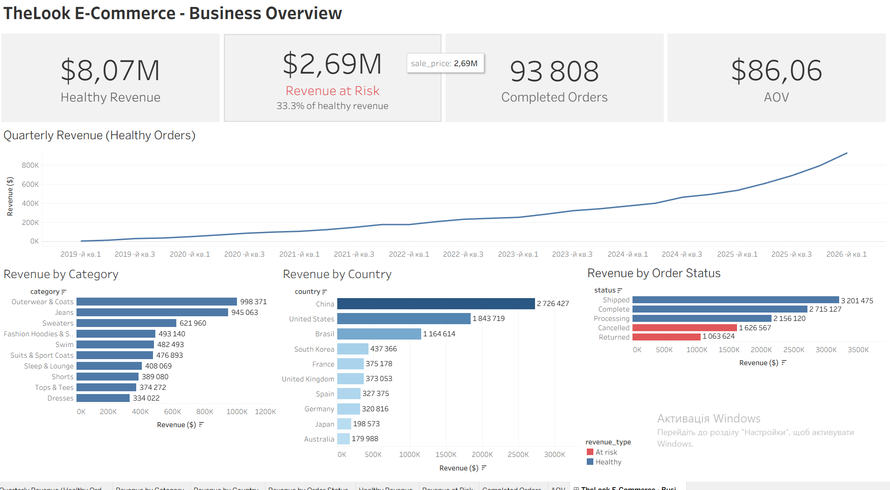

### 1. Оцінка Retention Rate методами когортного аналізу (SQL + Google Sheets)
Аналіз утримання користувачів за допомогою когортного аналізу.
Парсинг дат різних форматів, побудова когортної таблиці по місяцях,
сегментація користувачів за промо-ознакою (promo_signup_flag).
- Файл: cohort_analysis.sql
- [Переглянути когортну таблицю та висновки в Google Sheets](https://docs.google.com/spreadsheets/d/1pI7XmqLDWFUAI9USxObMJ52RRygDOwLkzALOVJupbTY/edit?usp=sharing)

### 2. Stack Overflow Developer Survey — Аналіз ринку праці розробників (Python/Pandas)
Аналіз глобального опитування розробників. Завантаження великого
датасету, фільтрація та групування даних, аналіз зарплат
Python-розробників по країнах (середнє та медіана), дослідження
рівня освіти найбільш оплачуваних спеціалістів.
- Файл: stackoverflow_survey.ipynb

### 3. Titanic — Аналіз виживаності пасажирів (Python/Pandas)
Аналіз даних пасажирів Титаніка. Обробка пропущених значень,
заповнення віку медіаною, створення вікових категорій через
власну функцію, аналіз смертності по вікових категоріях
та групування по місту посадки.
- Файл: titanic_analysis.ipynb

### 4. TheLook E-Commerce — Дашборд огляду бізнесу (SQL + Tableau)

Інтерактивний дашборд на даних BigQuery: виручка, зростання, втрати на 
скасуваннях/поверненнях ($2.69M, 33.3%). JOIN чотирьох таблиць, узгоджені 
метрики (Healthy Revenue, AOV, Completed Orders), перевірка гіпотез.

- Файл: thelook_queries.sql
- 
